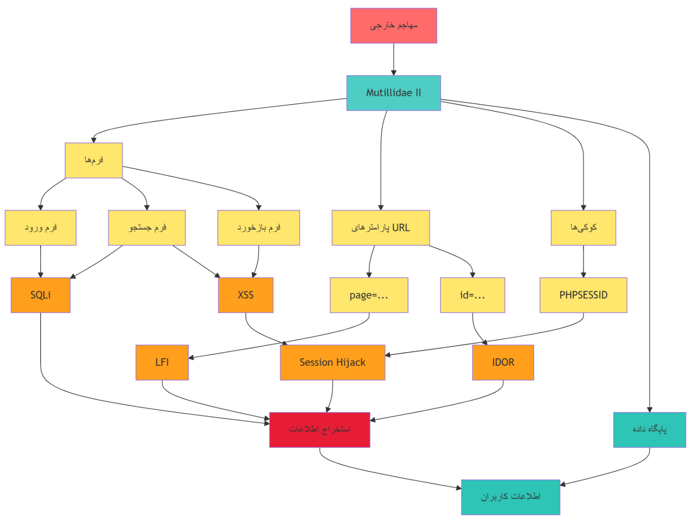

# Threat Model

## Assets

**Accounts**
- Regular user accounts (limited privileges)
- Administrative accounts (full access to settings and logs)
- Active user sessions

**Data**
- User records in MySQL (username, password, email)
- Activity/transaction history
- Session cookies
- Server and application logs

**Administrative capabilities**
- Log viewer (`view-log.php`)
- Security-level settings
- Application configuration pages

## Likely attackers

- **Internal attackers** — people with legitimate access to the system who could abuse it
- **External attackers** — outsiders actively trying to break in
- **Unintentional users** — people who create risk through carelessness or lack of security awareness, rather than malicious intent

## Attack scenarios

- **SQL Injection** — an attacker submits `' OR '1'='1` in the
  `user-info.php` search form and gains access to the full user table.
- **Cross-Site Scripting** — an attacker submits
  `` through the `add-to-your-blog.php`
  feedback form; the script runs in other users' browsers and can steal
  their cookies.
- **Insecure Direct Object Reference (IDOR)** — changing the `id`
  parameter in the URL from `?id=2` to `?id=3` exposes another user's
  data, with no authorization check in between.
- **Denial of Service** — flooding the server with concurrent requests to
  exhaust resources and cause a temporary outage.

## Threat model diagram

The diagram traces how an external attacker reaches Mutillidae's forms,
URL parameters, and cookies, and how each entry point maps to a class of
exploit (SQLi, XSS, LFI, Session Hijacking, IDOR) that ultimately leads to
data exfiltration and exposure of user information.

## Summary

Based on this analysis, the most critical threats facing Mutillidae are
**SQL Injection** and **XSS**, leading respectively to full data
disclosure and session theft. Both have a high likelihood of occurrence
due to the number of input forms and the lack of proper server-side
validation.

The next phase of the project puts these threats to a practical test with
Burp Suite, with a documented proof-of-concept for each — see
[`findings/`](findings).
