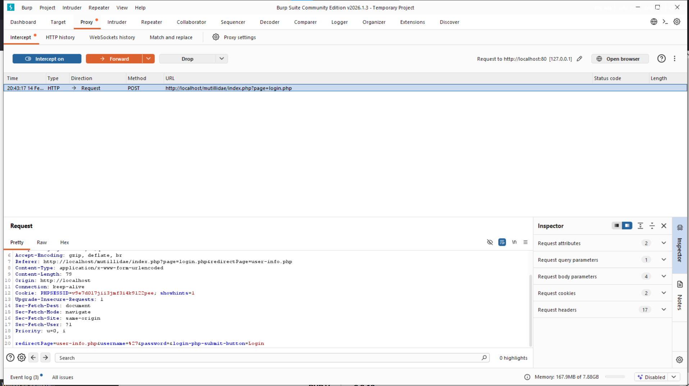
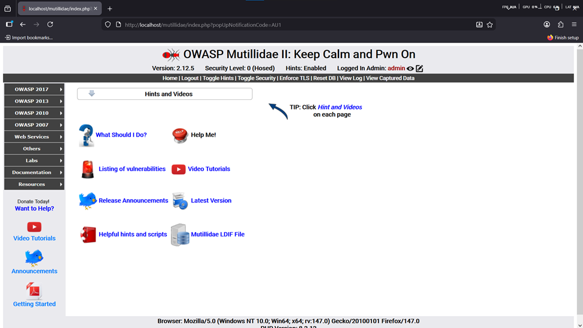

# Finding 1 — SQL Injection (Authentication Bypass)

**Risk: 🔴 Critical** · Impact: High · Likelihood: High

## Description

SQL Injection occurs when an application uses user input directly inside
a database query without proper handling. An attacker can send SQL
statements through an input field to alter the intended query, exposing
confidential data, bypassing authentication, or even modifying data.

## Affected endpoint

Mutillidae's main login form:

```
http://localhost/mutillidae/index.php?page=user-info.php
```

- Method: `POST`
- Vulnerable parameters: `username`, `password`
- Security level: 0

## Proof of concept

**Step 1 — Confirm the vulnerability with a single quote**

Entering `'` into the Username field and intercepting the request in Burp
shows `%27` (the URL-encoded `'`) going straight through to the backend —
evidence the input lands unmodified in the query.



**Step 2 — Inject an always-true condition**

Username: `' OR '1'='1`, Password: any value (e.g. `123`). Burp intercepts
the request showing these values going to the server:


**Step 3 — Observe the result**

After forwarding the request, the app redirects to a welcome page logged
in as **admin**:



## Root cause analysis

The backend query is most likely built like this:

```sql
SELECT * FROM users
WHERE username = '$input'
AND password = '$password'
```

When the attacker submits `' OR '1'='1` as the username, the final query
becomes:

```sql
SELECT * FROM users
WHERE username = '' OR '1'='1'
AND password = '123'
```

Since `'1'='1'` is always true, the `WHERE` clause is satisfied for every
row, and the database returns the first record — typically the `admin`
account. The application treats that returned row as a valid,
authenticated user and grants access.

## Impact

- Complete authentication bypass
- Access to the administrator account
- In more advanced scenarios, data extraction or modification
- Full application compromise

## Remediation

**a) Prepared statements (primary fix)**

Send the query structure and the data separately: define the query with
`?` placeholders first, then bind the actual values to it afterward. User
input is never interpreted as part of the SQL statement — even a raw `'`
is treated as ordinary data, not query syntax.

**b) Input validation**
- Use a whitelist instead of a blacklist
- Explicitly handle special characters like `'`, `;`, `--`
- Validate length and type

**c) Authentication principles**
- Never base authentication purely on a raw query result
- Add multi-step verification
- Enforce role-based access control
- Never leave an admin account trivially reachable by default

**d) Password hashing**

Never store passwords as plain text. Hash them with a strong function
(e.g. `password_hash()` in PHP) before storing; on login, hash the
submitted password and compare hashes. This way, even a database leak
doesn't expose usable passwords.
