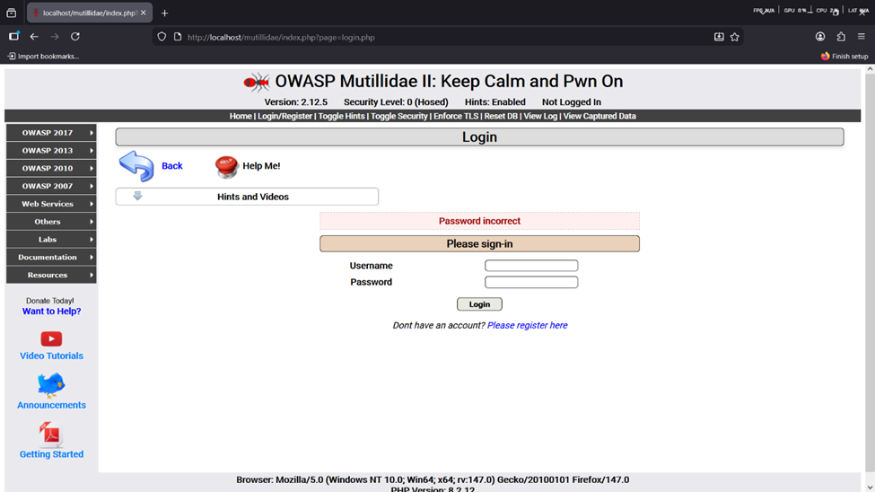
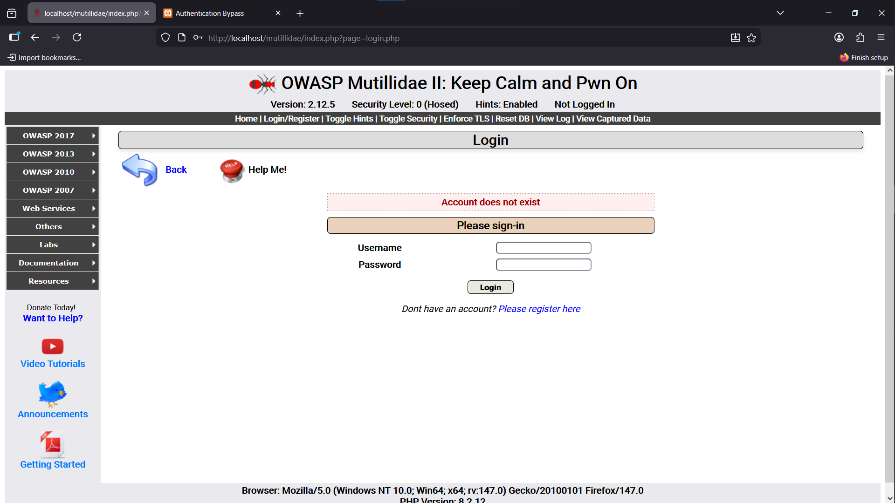
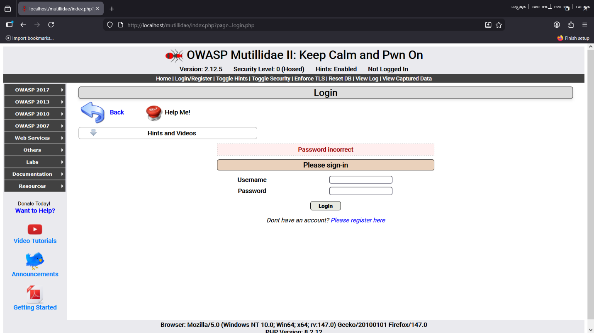

# Finding 2 — Broken Authentication

**Risk: 🟠 High** · Impact: High · Likelihood: High

## Description

Broken authentication occurs when a login mechanism has security
weaknesses. Mutillidae exhibits two: no limit on login attempts (enabling
brute-force attacks), and user enumeration through inconsistent error
messages.

## Affected endpoint

```
http://localhost/mutillidae/index.php?page=login.php
```

## Proof of concept

**Step 1 — Compare error messages**

*Scenario A — correct username, wrong password:*
Username `admin`, password `1234` →



*Scenario B — invalid username, wrong password:*
Username `ghalat` (nonsense), password `1234` →



The difference between "password incorrect" and "account does not exist"
lets an attacker determine whether a given username exists at all — user
enumeration.

**Step 2 — Confirm there's no attempt limit**

Using Burp Suite, several consecutive requests were sent with the correct
username and different passwords (`admin`/`1111`, `admin`/`2222`,
`admin`/`3333`, ...) — every single one was processed with no lockout, no
CAPTCHA, and no delay:



## Root cause analysis

Three underlying issues:

1. **No rate limiting** — nothing locks the account or throttles requests
   after repeated failed attempts (e.g. after 5 tries).
2. **Distinguishable error messages** — the username-vs-password error
   difference enables user enumeration.
3. **Plaintext credentials over the wire** — authentication data is sent
   without encryption.

## Impact

If authentication is broken, an attacker can:
- Take over user accounts
- Gain full control if the compromised account is an admin
- Modify or delete data

All three CIA properties are at risk: **confidentiality** (user data
exposed), **integrity** (data can be altered), and **availability**
(the service could be disrupted).

## Remediation

**a) Rate limiting** — block further attempts for a period after a small
number of consecutive failures (e.g. 5), defeating automated brute-force
and password-guessing tools.

**b) CAPTCHA** — require a challenge after repeated failures to
distinguish humans from automated tools.

**c) Uniform error messages** — always respond with the same generic
message (e.g. "Invalid username or password") regardless of which field
was wrong, so the system never reveals whether a username exists.

**d) HTTPS everywhere** — encrypt all traffic between browser and server
so credentials can't be sniffed in transit.

**e) Temporary account lockout** — after repeated failures against a
specific username, lock that account for a set period (e.g. 30 minutes),
even against an attacker who already has the correct password, and give
administrators time to notice.
