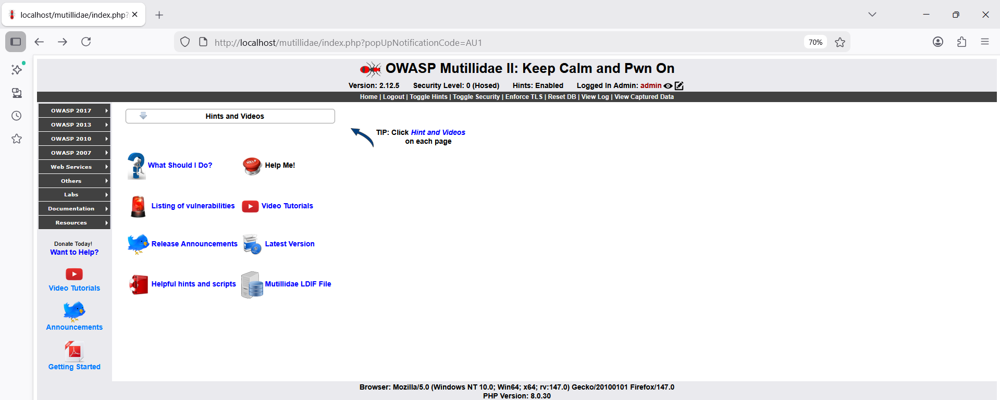
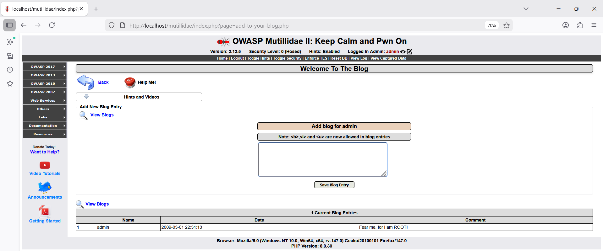
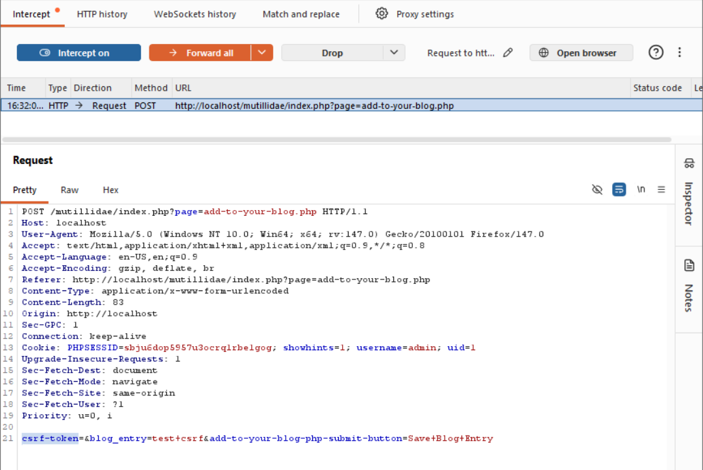
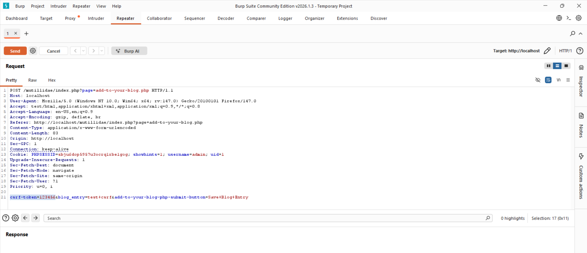
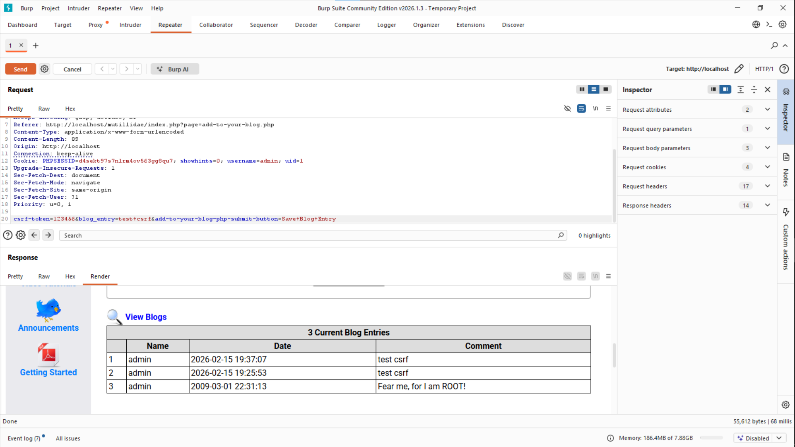

# Finding 3 — Cross-Site Request Forgery (CSRF)

**Risk: 🟠 High** · Impact: High · Likelihood: High

## Description

CSRF tricks an authenticated user's browser into submitting an unwanted
request to an application they're logged into. Mutillidae's blog-entry
form does include a `csrf-token` parameter — but the server never
actually checks its value, which makes the protection entirely
cosmetic.

## Affected endpoint

```
http://localhost/mutillidae/index.php?page=add-to-your-blog.php
```

- Method: `POST`
- Vulnerable parameter: `csrf-token` (not validated)
- Precondition: an authenticated session (here, obtained via the
  `' OR '1'='1` SQLi payload from [Finding 1](01-sql-injection.md))

## Proof of concept

**Step 1 — Log in**

Logged in using the SQLi payload (`' OR '1'='1`), landing on the admin
home page:



**Step 2 — Open the blog entry form**

Navigated to `add-to-your-blog.php`, which has a text field for a blog
post:



**Step 3 — Submit normally and inspect the request**

Entered "test csrf" and clicked "Save Blog Entry." Burp intercepts the
request — `csrf-token` is present, but **empty** (`csrf-token=`) — and the
request is still processed successfully:



**Step 4 — Try an arbitrary token in Repeater**

To confirm the token truly isn't checked, the request was sent to
Repeater with `csrf-token` changed to `123456`:



**Step 5 — Observe the result**

The forged request succeeds and a new blog entry is added, alongside
earlier test entries:



**Step 6 — What a real attack would look like**

An attacker could host a simple HTML page that auto-submits this same
form. If a logged-in victim opens that page (or clicks a button on it), a
blog post would be published under their name without their intent.

## Root cause analysis

A real CSRF token should:
- Be random and unpredictable
- Be unique per session
- Be stored and validated server-side
- Cause the request to be rejected if it doesn't match

Here, none of that happens:
- No real token is ever generated
- The token is submitted empty
- The server performs no validation at all
- Even an arbitrary value (`123456`) is accepted

This is arguably worse than having no token field at all — it *looks*
secure, which can lead developers (and reviewers) to assume protection
exists when it provides none.

## Impact

- Actions performed under the victim's identity without their knowledge
- Forged blog posts attributed to the victim
- Potentially much more serious consequences if applied to sensitive
  operations (password changes, fund transfers, etc.)

**Why likelihood is rated high:** the victim only needs to open a
malicious link — no security mechanism blocks it, and no technical
sophistication is required of the attacker.

## Remediation

**a) Random, unique CSRF tokens** — generate an unpredictable,
per-session token and embed it as a hidden field in sensitive forms.

**b) Server-side validation** — compare the submitted token against the
one stored in the user's session on every request; reject on mismatch.

**c) `SameSite` cookies** — set the session cookie's `SameSite` attribute
to `Strict` or `Lax` so the browser only sends it with same-site
requests.

**d) Use framework-provided protections** — modern frameworks (Laravel,
Django, ASP.NET Core) generate and validate CSRF tokens automatically;
enabling that built-in support avoids reimplementing this by hand.

**e) Restrict sensitive actions to POST** — state-changing operations
like password changes or posting content should only ever be accepted
via POST, since CSRF attacks are typically delivered through `` tags
or GET links.

**f) Double-submit cookie pattern** — store the CSRF token both as a
cookie and as a form field, and have the server compare the two without
needing server-side session storage — useful for stateless/distributed
systems.
