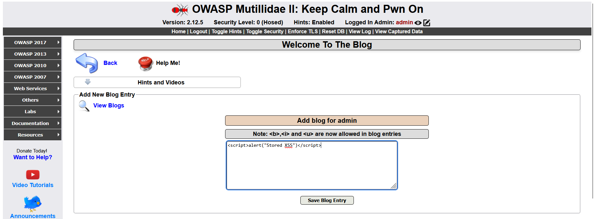
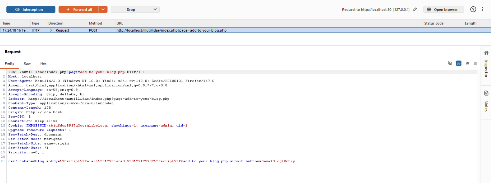
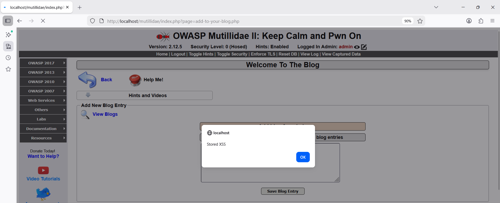
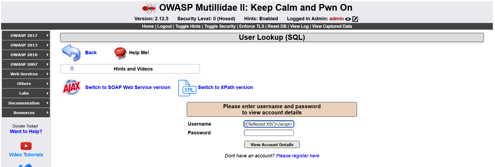
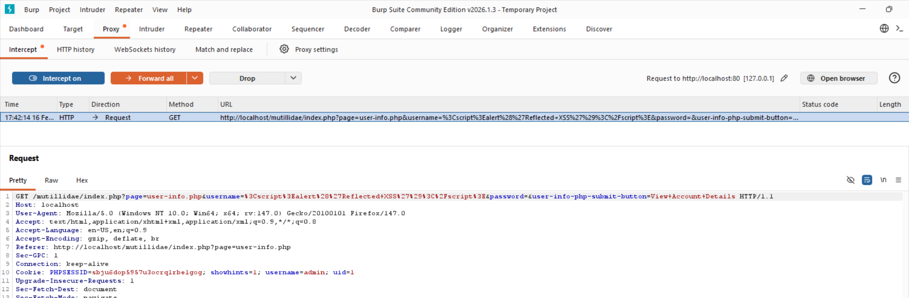
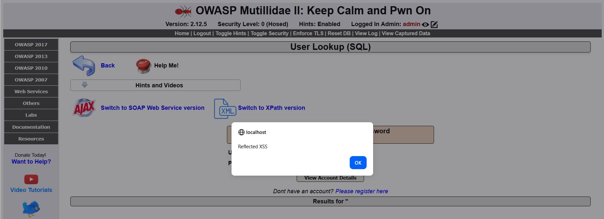

# Finding 4 — Cross-Site Scripting (XSS)

**Risk: 🟠 High** · Impact: High · Likelihood: High (Stored) / Medium (Reflected)

## Description

XSS lets an attacker inject malicious JavaScript into pages served to
other users. That script then runs in the victim's browser, where it can
steal cookies/sessions or perform actions on the victim's behalf.
Mutillidae has both variants: **stored** XSS in the blog feature, and
**reflected** XSS in the user search page.

## Affected endpoints

**Stored XSS**
```
http://localhost/mutillidae/index.php?page=add-to-your-blog.php
```
- Method: `POST`, vulnerable parameter: `blog_entry`
- The payload is saved to the database and rendered for every user who
  views the blog.

**Reflected XSS**
```
http://localhost/mutillidae/index.php?page=user-info.php
```
- Method: `POST`, vulnerable parameter: `username`
- The payload is reflected directly back in the HTTP response.

## Proof of concept — Stored XSS

**Step 1 — Submit a simple payload**

In the blog entry field:

```html
<script>alert("Stored XSS")</script>
```



**Step 2 — Intercept with Burp**

The URL-encoded payload
(`%3Cscript%3Ealert%28%27Stored+XSS%27%29%3C%2Fscript%3E`) is visible
going to the server:



**Step 3 — Forward and observe**

Once saved, reloading the page triggers the injected script — an alert
box pops up with "Stored XSS" every time the page loads:



The payload is now persisted in the database and will fire for **every**
visitor to that page, not just the one who submitted it.

## Proof of concept — Reflected XSS

**Step 1 — Submit the payload in the search field**

On `user-info.php`, in the `username` field:

```html
<script>alert('Reflected XSS')</script>
```



**Step 2 — Intercept and forward**

Burp shows the payload going out as a `GET` request:



**Step 3 — Observe the result**

The server's response echoes the script straight back, and it executes
immediately:



## Root cause analysis

Both cases come down to missing output sanitization/encoding:

- User input is stored (or reflected) completely unmodified
- When rendered, that content is inserted directly into the HTML
- No sanitization function is applied anywhere in the path
- The reflected case echoes input straight into the response with the
  same lack of encoding

## Impact

- **Session hijacking** — reading `document.cookie` to steal session cookies
- **Defacement** — altering what the page shows
- **Phishing** — redirecting users to malicious pages
- **Keylogging** — capturing keystrokes

**Stored vs. reflected severity:** stored XSS is more dangerous because
it affects every visitor to the page automatically; reflected XSS
requires tricking a victim into clicking a crafted link.

## Remediation

**a) Output encoding (primary fix)** — before rendering any user-supplied
data, convert HTML-significant characters (`<`, `>`, `&`, `"`) to their
safe equivalents. In PHP, `htmlspecialchars()` prevents injected HTML/JS
from being interpreted as markup by the browser.

**b) Content Security Policy (CSP)** — send a `Content-Security-Policy`
header declaring which sources scripts are allowed to run from. Even if
malicious input slips through, the browser refuses to execute it.

**c) Server-side input validation** — sanitize input before it's ever
stored, e.g. stripping tags with `strip_tags()` or filtering with
`filter_var()`.

**d) Use modern frameworks** — frameworks like Laravel, Django, and
ASP.NET Core auto-escape output by default in their templating syntax.

**e) `HttpOnly` cookies** — mark session cookies `HttpOnly` so
JavaScript can't read them at all, limiting the damage even if an XSS
bug slips through.
