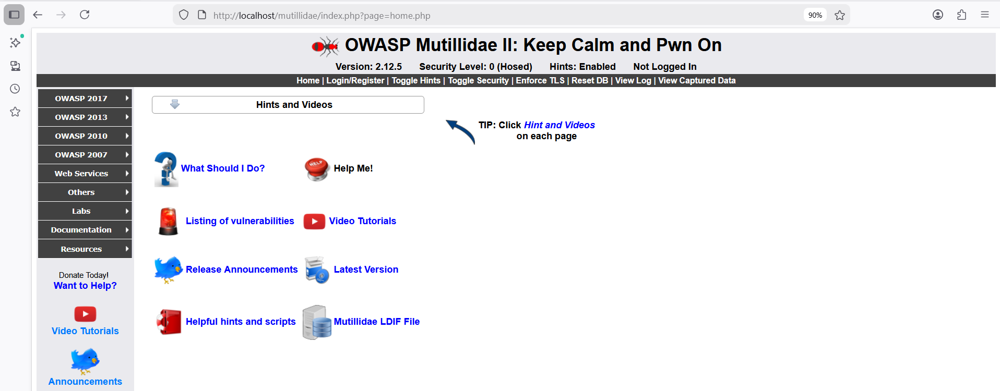
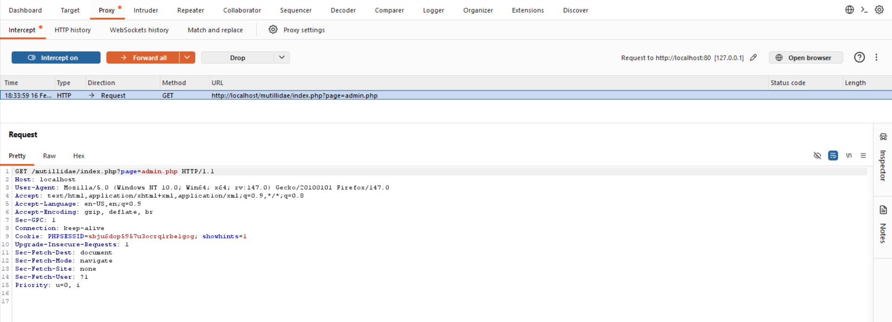
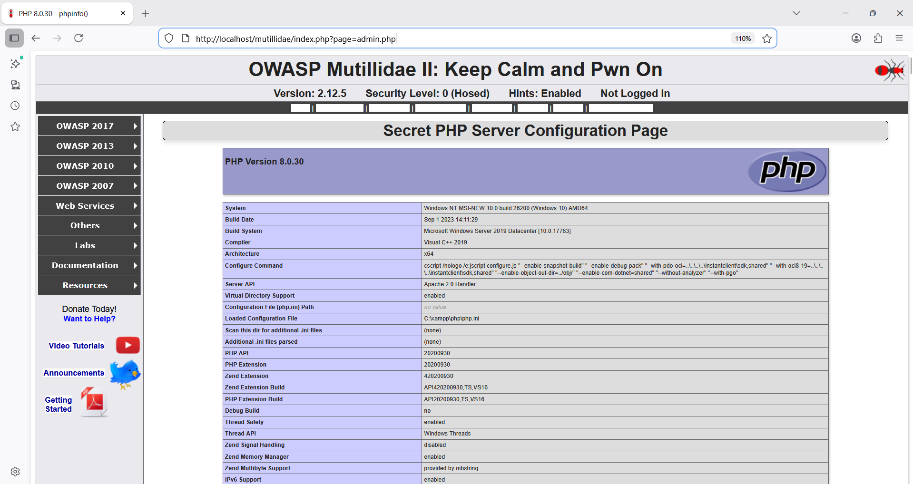

# Finding 5 — Broken Access Control

**Risk: 🟡 Medium** · Impact: Medium–High · Likelihood: High

## Description

Broken access control occurs when users can reach resources or actions
beyond what their privilege level should allow. In Mutillidae, this is
exploitable simply by editing the `page` URL parameter — a regular (or
even anonymous) user can reach administrative pages and system logs just
by typing a different filename.

## Affected endpoint

Exploitable across multiple pages via the `page` parameter:

```
http://localhost/mutillidae/index.php?page=[page name]
```

- Vulnerable parameter: `page`
- Method: `GET`

**Sensitive pages reachable this way:**
- Log viewer: `view-log.php`
- Admin page: `admin.php`
- Security settings: `security-level-toggle.php`
- Others: `pass-change.php`, `user-administration.php`

## Proof of concept

**Step 1 — Confirm baseline access as a regular/anonymous user**

Without logging in, the home page loads normally:

```
http://localhost/mutillidae/index.php?page=home.php
```



**Step 2 — Request the admin page directly**

With Intercept on, navigated to:

```
http://localhost/mutillidae/index.php?page=admin.php
```

Burp intercepts the request:



**Step 3 — Forward and observe the result**

The admin page loads anyway — while still shown as **"Not Logged In"** —
exposing sensitive server configuration (PHP version, server settings,
environment variables, install paths, and more):



## Root cause analysis

This happens because the server never checks **authorization**, only
whether the requested file exists:

- The `page` parameter is taken straight from the URL
- No check is made against the current user's access level
- Any existing file can be included by any visitor
- `admin.php` is reachable by everyone, including anonymous users

## Impact

- **Direct access to the admin page** with sensitive server details exposed
- **Configuration disclosure**: PHP version, install paths, server settings
- **Reconnaissance for further attacks**: knowing exact software versions
  lets an attacker look up version-specific known vulnerabilities

**Information exposed on `admin.php`:**
PHP version and installed modules, Apache version, document root, 
environment variables, PHP security settings, and more.

**Realistic attack scenario:** an attacker discovers `admin.php` is
reachable, pulls exact PHP/Apache version numbers from it, looks up known
vulnerabilities for those specific versions, and builds a targeted attack
around what was learned.

## Remediation

**a) Server-side authorization checks** — maintain a mapping of user
roles to the pages each role may access, and check the current user's
role against that mapping before rendering any page.

**b) Simple whitelisting** — split pages into "public" and "admin-only"
categories; if the requested page isn't on the whitelist for the current
role, redirect to a default page. This is the simplest, most effective
fix for `page`-parameter manipulation specifically.

**c) A dedicated access-check function** — centralize the authorization
check in one function called at the top of every admin page; return a
403 immediately if the user lacks the required role.

**d) Prevent path traversal** — use functions like `basename()` and strip
dangerous sequences like `../` from user input, ensuring only files
inside the intended directory can ever be included.
